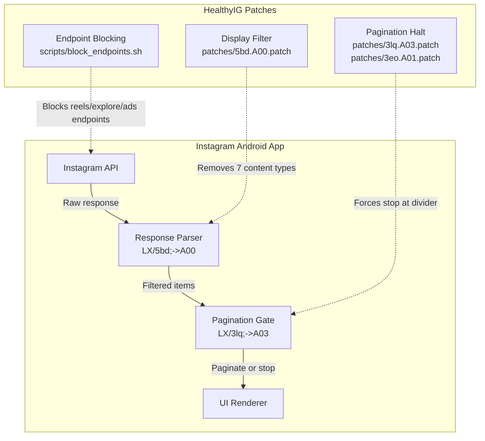

<p align="center">
  
</p>

<p align="center">
  <strong>Strip Instagram of reels, suggested content, and ads — without breaking what matters.</strong>
</p>

<p align="center">
  <a href="#features">Features</a> •
  <a href="#architecture">Architecture</a> •
  <a href="#quick-start">Quick Start</a> •
  <a href="#project-structure">Project Structure</a> •
  <a href="#patches">Patches</a> •
  <a href="#troubleshooting">Troubleshooting</a>
</p>

---

HealthyIG is a set of SMALI patches for the Instagram Android app that removes unwanted UI elements — reels, suggested posts, explore tab, and ads — while preserving core functionality: home feed, stories, direct messages, and search. No root required.

## Features

| Category | Status |
|----------|--------|
| Home feed (followed accounts) | ✅ Working |
| Stories (tray + profile) | ✅ Working |
| Direct messages | ✅ Working |
| Search | ✅ Working |
| DM'd reels from friends | ✅ Working |
| Reels tab | ❌ Removed |
| Explore / Discover | ❌ Removed |
| Suggested posts in feed | ❌ Filtered |
| Suggested reels in feed | ❌ Filtered |
| Ads and sponsored posts | ❌ Filtered |
| Scroll past "all caught up" divider | ❌ Halted |

## Architecture

HealthyIG operates on three independent layers. Each can be applied or removed separately.



### Layer 1: Endpoint Blocking

[`scripts/block_endpoints.sh`](scripts/block_endpoints.sh) rewrites SMALI to intercept network requests to Instagram's API. Targeted endpoints — reels feeds, explore, suggested content, ads — are short-circuited so the app never processes their responses. Requests still reach Instagram's servers, but the client ignores them.

### Layer 2: Display Filter

[`patches/5bd.A00.patch`](patches/5bd.A00.patch) modifies the `LX/5bd;->A00` method, Instagram's client-side content classifier. Each feed item carries a type tag (enum). The patch skips rendering for seven types:

- `MIXED_UNCONNECTED` — suggested posts
- `CLIPS_NETEGO` — suggested reels
- `SUGGESTED_USERS` / `SUGGESTED_PRODUCERS` — account suggestions
- `SUGGESTED_HASHTAGS` — hashtag suggestions
- `STORIES_NETEGO` — story suggestions
- `AD` — sponsored content

The `END_OF_FEED_DEMARCATOR` type is explicitly preserved so the "all caught up" divider still appears.

### Layer 3: Pagination Halt

Two patches work together to stop the feed from loading more content after the "all caught up" divider:

- **`patches/3lq.A03.patch`** — The original pagination gate (`LX/3lq;->A03()Z`) checked whether the **last** displayed item was the end-of-feed bookmark. Instagram's response parser inserts replacement recommendations after the bookmark, so it was never last. The patch checks whether the bookmark appears **anywhere** in the list by delegating to `LX/3vm;->A06()`.

- **`patches/3eo.A01.patch`** — Instagram has a server-controlled preference `is_ifr_eligible` that can override the pagination gate. When enabled, the controller bypasses the end-of-feed check entirely and continues loading content. The patch forces this preference to `false`.

## Quick Start

### Prerequisites

- **Linux** or **WSL2**
- **Java 17+** (`java -version`)
- **[apktool](https://apktool.org/) 2.11+** (`apktool.jar` in project root)
- **Android SDK build-tools 34+** (provides `zipalign` and `apksigner`)
- **Stock Instagram APK** (version 436.0.0.41.73 recommended)

### Build

```bash
# 1. Decompile the stock APK
apktool d Instagram.apk -o ig_plain

# 2. Apply display filter (removes suggested posts, reels, ads)
patch -p1 < patches/5bd.A00.patch

# 3. Apply pagination halt (stops feed at "all caught up")
patch -p1 < patches/3lq.A03.patch
patch -p1 < patches/3eo.A01.patch

# 4. Apply endpoint blocking (removes reels tab, explore, ads endpoints)
./scripts/block_endpoints.sh ig_plain

# 5. Optional: apply parser-level filter
./scripts/patch_parser.sh ig_plain

# 6. Rebuild the APK
apktool b ig_plain -o install_unsigned.apk

# 7. Align and sign
zipalign -p -f -v 4 install_unsigned.apk install_aligned.apk

# Generate keystore (first time only)
keytool -genkeypair -v -keystore healthyig.jks -alias key0 \
  -keyalg RSA -keysize 2048 -validity 10000 \
  -storepass password -keypass password \
  -dname "CN=HealthyIG, O=Android, C=IT"

apksigner sign --ks ./healthyig.jks --ks-pass pass:password \
  --key-pass pass:password --v1-signing-enabled true \
  --v2-signing-enabled true --v3-signing-enabled true \
  --min-sdk-version 21 --out install.apk install_aligned.apk

# 8. Install
adb uninstall com.instagram.android   # required if signature changed
adb install install.apk
```

### Verify Patches Are Applied

```bash
# Display filter: should show 7 enum checks
grep -c "sget-object.*LX/3eh;->A0" ig_plain/smali/X/5bd.smali

# Pagination halt: should delegate to A06
grep "invoke-static.*A06.*Collection" ig_plain/smali/X/3lq.smali

# IFR override: should return false
grep "const/4 v0, 0x0" ig_plain/smali/X/3eo.smali
```

## Project Structure

```
HealthyIG/
├── assets/
│   └── logo.svg              # Project logo
├── patches/
│   ├── 5bd.A00.patch         # Display filter — removes 7 content types
│   ├── 3lq.A03.patch         # Pagination gate — any-A0G detection
│   └── 3eo.A01.patch         # Server preference override — return false
├── scripts/
│   ├── block_endpoints.sh    # Endpoint blocker (SMALI rewrites)
│   └── patch_parser.sh       # Additional parser-layer filter
├── docs/
│   └── GUIDE_WSL.md          # WSL2 setup guide
├── CHANGELOG.md
├── LICENSE
└── README.md
```

## Patches

Each patch targets a specific SMALI method. They are designed to be minimal — none modifies more than 30 lines of bytecode.

| Patch | Target | Change | Lines Changed |
|-------|--------|--------|---------------|
| `5bd.A00.patch` | `LX/5bd;->A00(LX/3vm;)Z` | Adds 7 enum type checks before the original classifier logic | ~30 |
| `3lq.A03.patch` | `LX/3lq;->A03()Z` | Replaces "last item is divider" with "any item is divider" via `LX/3vm;->A06` delegation | ~8 |
| `3eo.A01.patch` | `LX/3eo;->A01(LX/5tJ;)Z` | Replaces method body with `return false` | ~4 |

## Troubleshooting

| Symptom | Likely Cause |
|---------|--------------|
| Infinite spinner at feed end | `3eo.A01` not applied — `is_ifr_eligible` still active |
| Feed keeps scrolling past divider | `3lq.A03` not applied — original last-item check still in use |
| Suggested posts still visible | `5bd.A00` not applied, or enum count != 7 |
| App crashes on startup | Instagram version mismatch — use 436.0.0.41.73 |
| "App not installed" error | Signature mismatch — uninstall old version first |

### Patch Application Order

Apply patches before running the endpoint blocking script. The patches modify SMALI source files; `scripts/block_endpoints.sh` operates on the same decompiled directory and the two are independent. Applying patches first ensures the display filter works on the unmodified method before any endpoint changes.

## Compatibility

| Instagram Version | Status |
|-------------------|--------|
| 436.0.0.41.73 | ✅ Tested |
| Other versions | ⚠️ Patch may apply but enum values (`A0c`, `A0C`, etc.) may differ across builds |

## License

[MIT](LICENSE) — Copyright (c) 2026 Gianluca Meneghetti
